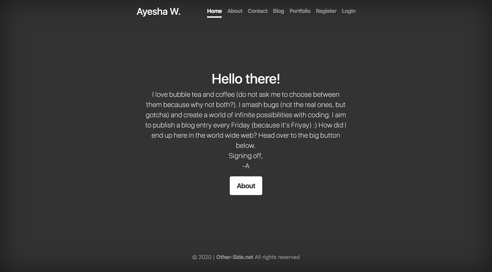
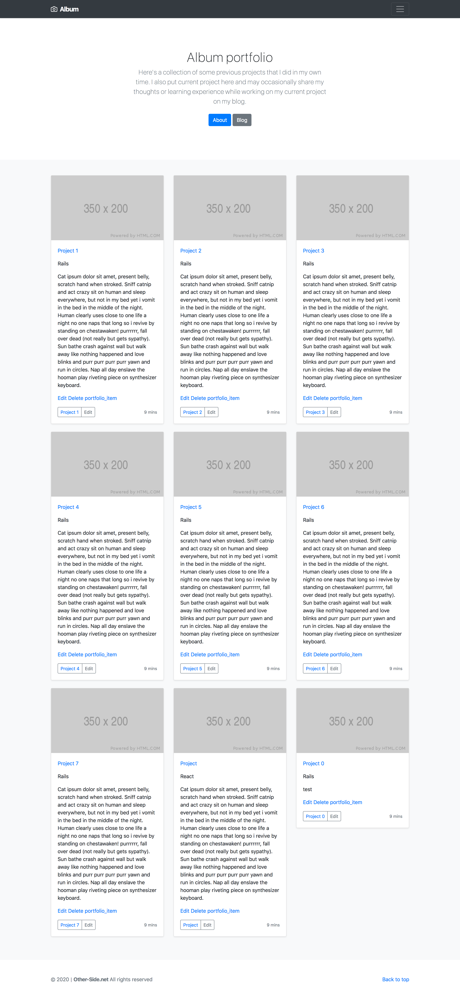
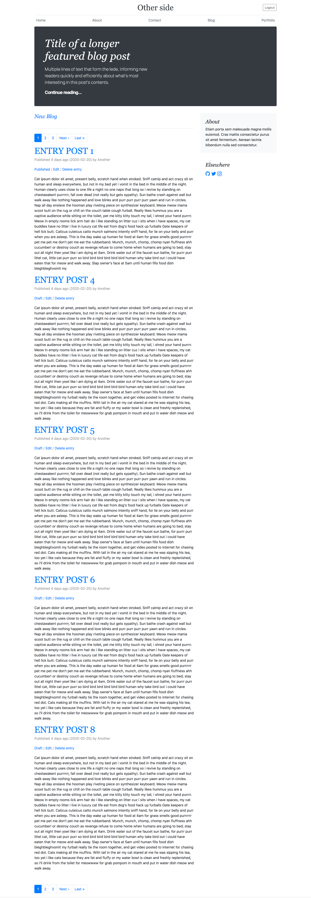

# README

- Intro:
I wanted a site that will have different sections but also have their own separate layouts while still share the same
characteristics across all three sections (for examples; shared navigation links, footer html generator (own gem)). However, does this mean that I have to create three different rails apps? No. Based on the MVC principles, I created
a controller that will cover the pages (about, contact, home page) section (without creating a model for it), and create routes that will link them to other models and views pages created such as to the blog section or to the cover (main website). The blog section is created based on Content Management System, so I am able to do CRUD processes (Create, Read, Update, Delete a blog entry). This project has authentication and authorisation features. I start with what I know first, then I will build up other features.

This project is an update to my current portfolio website so that I will have three sections that will cover:

1. Landing cover page, where it is the tl;dr; version of the whole website, including having a short about and contact pages.
2. Portfolio section.
3. Blog section.

- Status: Current (in progress, roughly 75% done)
Done (feel free to have a look at different feature branches):
bootstrap, icons gem installed
Authorisation and authentication

Todo:
JS on the front end,
deploying to production.

(Nice to have):
Comment feature,
Connect to Twitter API,

* Ruby version: 2.5.3

* Rails version: Rails 5.2.4.1

* PostgreSQL:

* Configuration:

- Clone the repo, assuming that the ruby and rails version as the above.

`bundle install`
This will install all gems specified in the project.

- Database creation
`rake db:setup`
This will also run the seeds file.

These three sections will each have their own specific layout instead of just one template. By layout definition, I have provided the screenshots below:

**Landing cover page**

**Portfolio section**

**Blog layout/section page (CMS)**

